## Welcome to LF Wholesale Grocery

### LF Wholesale Grocery is an online plateform to provide the grocery wholesale, and we also provide same and second day delivery service, depends on the location.

### The home page:
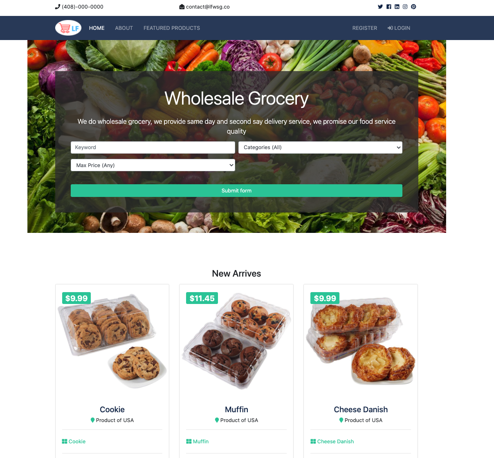

###  The about page:
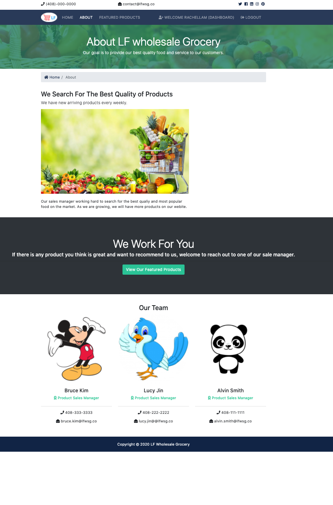

### The Single Product page
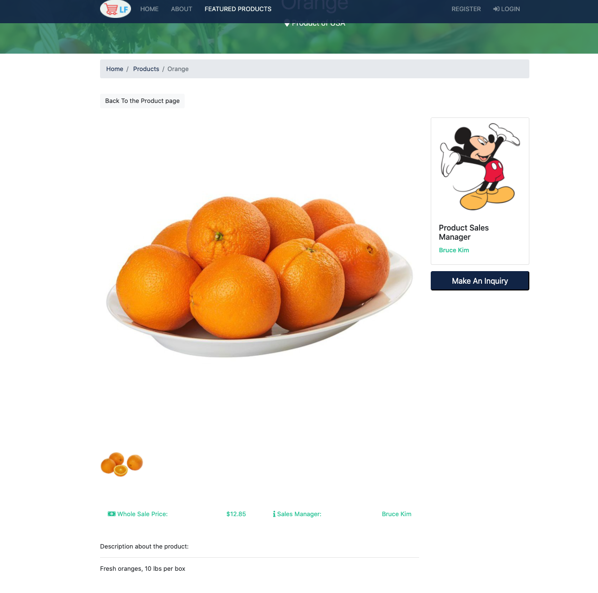

### The inquiry page without login


### Registerpage 
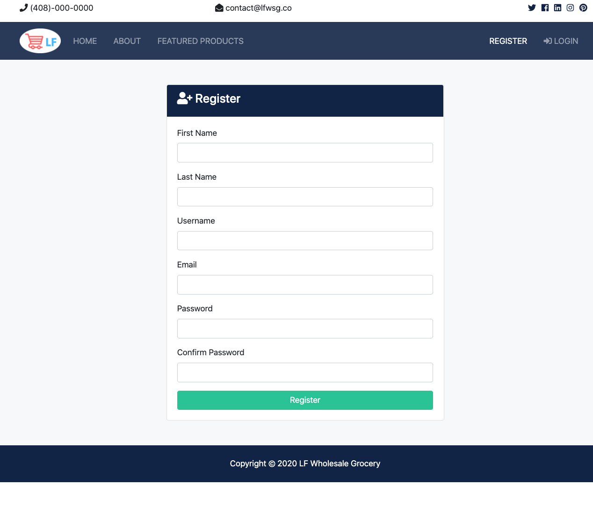

### The Login Page


### Login Alert with right credentials

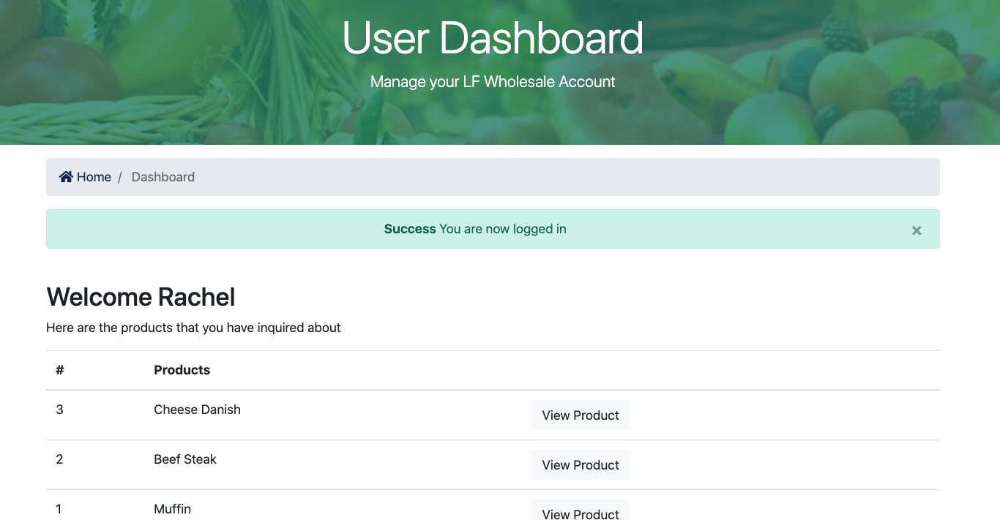

### Login alert with wrong credentials
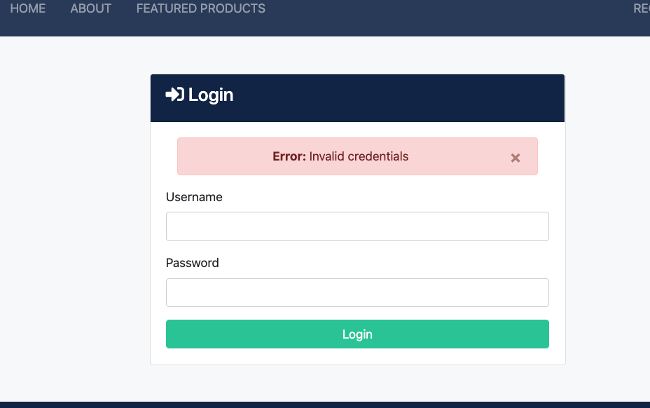

### Login User Dashboard Page

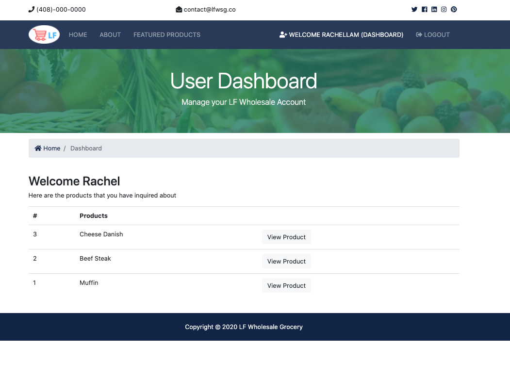

### User inquiry with login
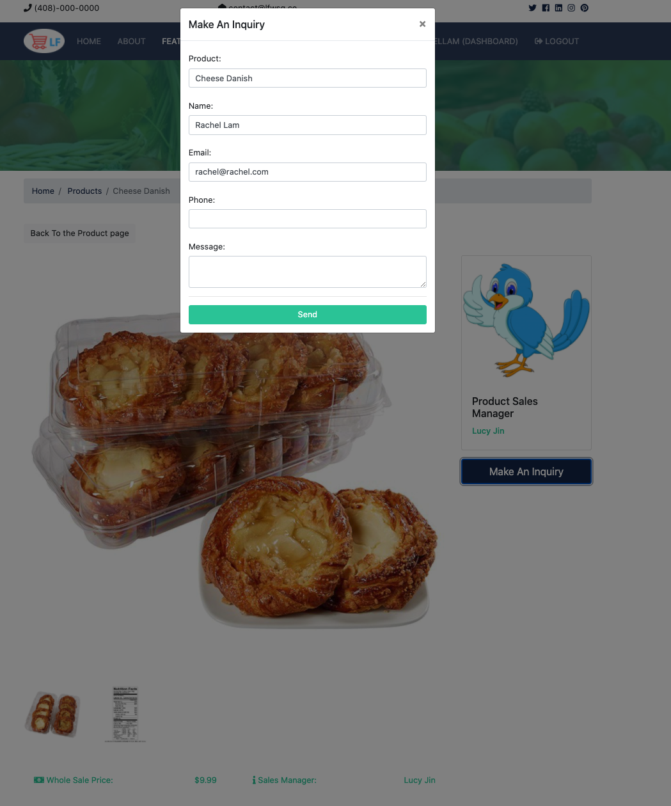

### The admin Login page
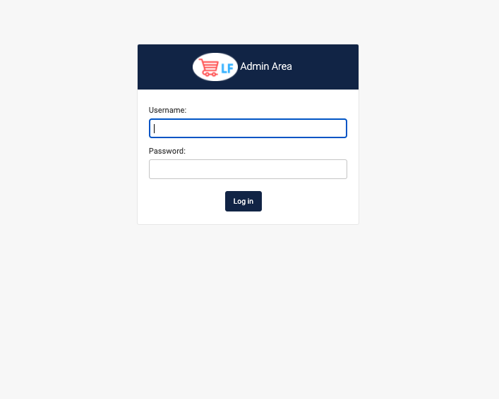

### The admin dashboard
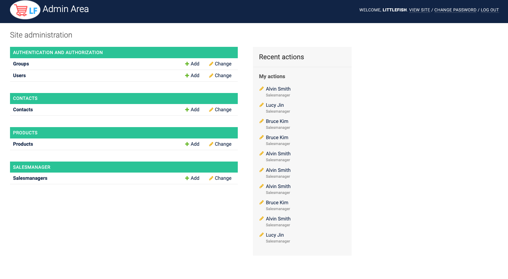

### Admin can add sales manager and products
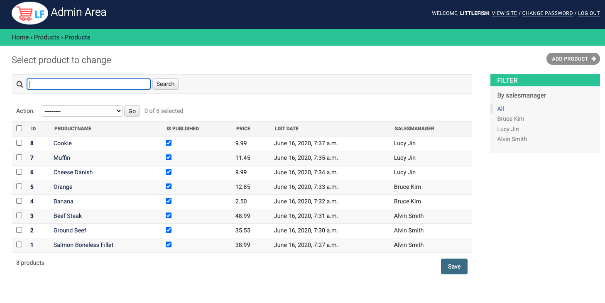
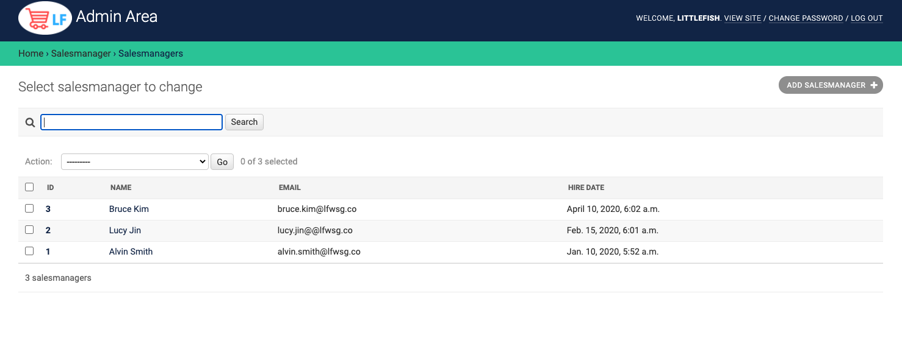

### The admin can also filter the products by sales manager
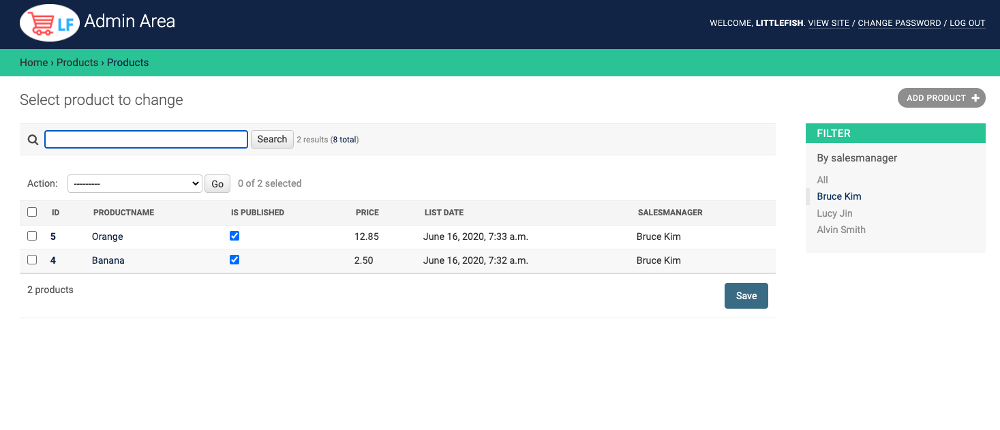

### For Django, we need to set an app for every event of out application, like products, sales managers, contact(for customer sent inquires)

#### to set up individual app, we should run the code below at vurtial environment
``` 
python manage.py startapp (event's name)
```
There will be several file auto generated in the event's folder
- \migrations, this is the folder Django stores migrations.
- __init__.py, this file is to tell python that yout event's app is a package.
- admin.py, this file is where you can register your app's models with Django admin.
- apps.py, this file is a configuration file common to all Django apps.
- models.py, this is the file for your app's models
- tests.py, this file will be run when test your app.
- views.py, this file is the views if your app

### Use Pagination for the page setup. 
#### we set the number of products showing per pages, and click the next page to view more products.


``` python

    paginator = Paginator(products, 6)
    page = request.GET.get('page')
    paged_products = paginator.get_page(page)

```

### Technologies I used in this application:
- Javascript
- CSS
- Boortstrap
- Python
- Django
- HTML
- Postgres